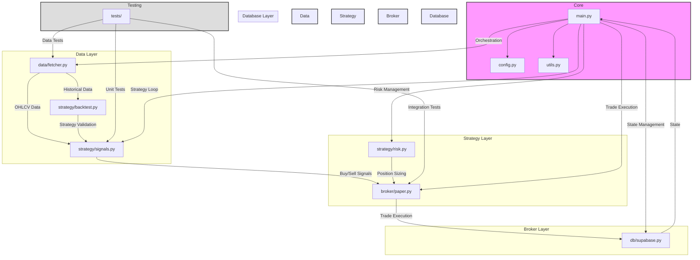

# Vibe-Trading: AI Trading Bot & Live Dashboard
**TOTAL HARD-RESETS: 2**

## Project Overview
An end-to-end, transparent sandbox where an AI trading bot generates simulated trades (via Alpaca paper trading) and broadcasts its portfolio, trade log, and performance through a public web dashboard.

## Core Features
- 🤖 AI-powered trading bot using SMA/RSI strategy
- 📊 Live dashboard with portfolio tracking
- 📈 Performance visualization vs. S&P 500
- 📝 Real-time trade feed
- ⚡ 15-minute delayed market data
- 🔒 Paper trading only - no real capital at risk

## Current Progress

### Completed
- ✅ Data Fetcher (`data/fetcher.py`)
  - Implemented caching for rate limits
  - Added error handling and logging
  - Tested with real API keys

- ✅ Strategy Logic (`strategy/signals.py` & `strategy/risk.py`)
  - Unit tested SMA/RSI logic
  - Refined position sizing
  - Integrated with backtesting

- ✅ Paper Trading (`broker/paper.py`)
  - Implemented Alpaca API integration
  - Added order validation
  - Trade tracking system

- ✅ Database (`db/supabase.py`)
  - Set up Supabase/Postgres tables
  - Implemented core database structure

### In Progress
- 🔄 Database Testing
  - Testing database writes and reads
  - Ensuring data consistency

- 🔄 Configuration & Utilities
  - Setting up environment variables
  - Enhancing logging system

### Pending
- ⏳ Main Loop Integration
- ⏳ Testing & QA
- ⏳ Documentation
- ⏳ Deployment

## Technical Stack
- Backend: Python (FastAPI)
- Frontend: Next.js
- Database: Supabase/Postgres
- Data Sources: Tiingo, Alpha Vantage
- Deployment: Vercel (Frontend), Docker (Backend)

## Repository Architecture

### Core Modules
- `main.py` - Entry point and orchestration of the trading bot
- `config.py` - Configuration management and environment variables
- `utils.py` - Shared utility functions and helpers

### Data Layer
- `data/fetcher.py` - Market data fetching from Tiingo/Alpha Vantage
  - Handles rate limiting and caching
  - Provides OHLCV data for analysis

### Strategy Layer
- `strategy/signals.py` - Trading signal generation
  - Implements SMA/RSI crossover logic
  - Generates buy/sell signals
- `strategy/risk.py` - Risk management
  - Position sizing calculations
  - Stop-loss management
- `strategy/backtest.py` - Strategy backtesting
  - Historical performance analysis
  - Strategy optimization

### Broker Layer
- `broker/paper.py` - Alpaca paper trading integration
  - Order execution simulation
  - Position tracking
  - Account management

### Database Layer
- `db/supabase.py` - Database operations
  - Trade history storage
  - Portfolio state management
  - Performance metrics

### Testing
- `tests/` - Unit and integration tests
  - Strategy validation
  - Data pipeline testing
  - Broker integration tests

### Documentation
- `PRD.md` - Product Requirements Document
- `trade-agent-plan.md` - Development roadmap
- `README.md` - Project overview and setup

## Disclaimer
This is an educational project for paper trading only. All trades are simulated and no real capital is at risk. Prices are delayed by at least 15 minutes.
