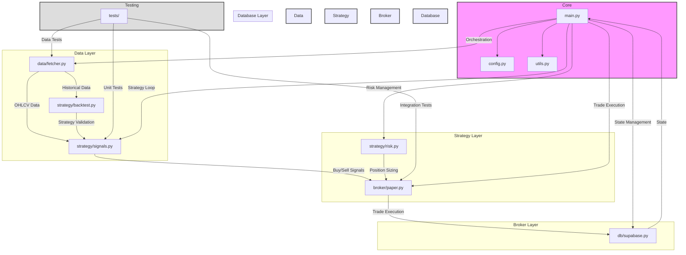

# Vibe-Trading: AI Trading Bot & Live Dashboard
**TOTAL HARD-RESETS: 2**

## Project Overview
An end-to-end, transparent sandbox where an AI trading bot generates simulated trades (via Alpaca paper trading) and broadcasts its portfolio, trade log, and performance through a public web dashboard. The bot implements a simple but effective trading strategy using SMA/RSI crossovers with strict risk management.

## Core Features
- 🤖 AI-powered trading bot using 20/50-day SMA crossover + RSI (70/30) strategy
- 📊 Live dashboard with portfolio tracking and equity curve
- 📈 Performance visualization vs. S&P 500
- 📝 Real-time trade feed with detailed order information
- ⚡ 15-minute delayed market data from Tiingo/Alpha Vantage
- 🔒 Paper trading only - no real capital at risk
- 📊 Comprehensive backtesting and performance metrics
- 🔄 Automated trading cycle every 5 minutes

## Setup Instructions

### Prerequisites
- Python 3.9+
- Docker and Docker Compose
- Supabase account
- Alpaca paper trading account
- Tiingo API key
- Alpha Vantage API key (backup)

### Environment Variables
Create a `.env` file in the root directory with the following variables:
```env
# API Keys
ALPACA_API_KEY=your_alpaca_key
ALPACA_SECRET_KEY=your_alpaca_secret
TIINGO_API_KEY=your_tiingo_key
ALPHA_VANTAGE_API_KEY=your_alpha_vantage_key

# Database
SUPABASE_URL=your_supabase_url
SUPABASE_KEY=your_supabase_key

# Trading Parameters
MAX_POSITIONS=3
RISK_PER_TRADE=0.02
STOP_LOSS=0.05
```

### Installation

1. Clone the repository:
```bash
git clone https://github.com/yourusername/vibe-trading.git
cd vibe-trading
```

2. Create and activate a virtual environment:
```bash
python -m venv venv
source venv/bin/activate  # On Windows: venv\Scripts\activate
```

3. Install dependencies:
```bash
pip install -r requirements.txt
```

4. Set up the database:
```bash
python scripts/setup_db.py
```

### Running the Bot

#### Using Docker (Recommended)
```bash
docker-compose up -d
```

#### Manual Start
```bash
python main.py
```

### Running Tests
```bash
pytest tests/
```

## Technical Stack
- Backend: Python (FastAPI)
- Frontend: Next.js
- Database: Supabase/Postgres
- Data Sources: Tiingo (primary), Alpha Vantage (backup)
- Deployment: Vercel (Frontend), Docker (Backend)

## Repository Architecture



## Module Documentation

### Core Modules
- `main.py` - Entry point and orchestration of the trading bot
  - Implements the main trading loop
  - Handles error recovery and logging
  - Manages the 5-minute trading cycle

- `config.py` - Configuration management
  - Environment variable validation
  - Trading parameters
  - API credentials

- `utils.py` - Shared utilities
  - Logging configuration
  - Error handling
  - Helper functions

### Data Layer
- `data/fetcher.py` - Market data management
  - Rate-limited API calls
  - Data caching
  - Fallback data sources

### Strategy Layer
- `strategy/signals.py` - Trading signals
  - 20/50-day SMA crossover logic
  - RSI (70/30) filter
  - Signal generation

- `strategy/risk.py` - Risk management
  - 2% account equity per trade
  - 5% stop-loss implementation
  - Maximum 3 open positions

- `strategy/backtest.py` - Strategy validation
  - Historical performance analysis
  - Sharpe ratio calculation
  - Strategy optimization

### Broker Layer
- `broker/paper.py` - Alpaca integration
  - Paper trading execution
  - Position management
  - Order validation

### Database Layer
- `db/supabase.py` - Data persistence
  - Trade history
  - Portfolio state
  - Performance metrics

## Testing
- Unit tests for each module
- Integration tests for data flow
- End-to-end tests for trading cycle
- Performance benchmarks

## Contributing
1. Fork the repository
2. Create a feature branch
3. Commit your changes
4. Push to the branch
5. Create a Pull Request

## License
This project is licensed under the MIT License - see the [LICENSE](LICENSE) file for details.

## Disclaimer
This is an educational project for paper trading only. All trades are simulated and no real capital is at risk. Prices are delayed by at least 15 minutes. This project is not financial advice and should not be used for real trading without proper risk assessment and professional guidance.
