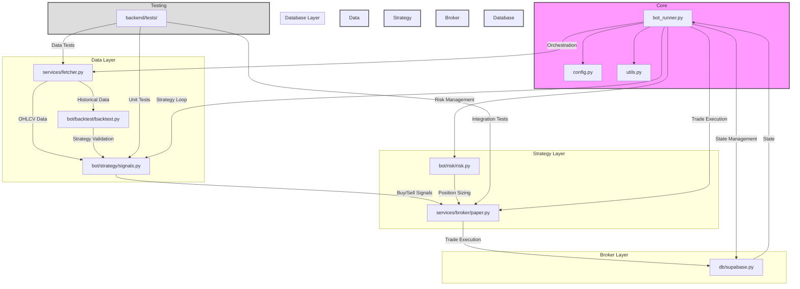

# Vibe-Trading: AI Trading Bot & Live Dashboard
**TOTAL HARD-RESETS: 2**

## Project Overview
An end-to-end, **transparent sandbox** where an AI trading bot generates simulated trades (via Alpaca paper trading) and broadcasts its portfolio, trade log, and performance through a public web dashboard. The bot implements a simple but effective trading strategy using SMA/RSI crossovers with strict risk management. This project is designed to be educational and transparent, not advisory.

## Project Status
- ✅ Backend trading bot (Step 1 Complete)
- ✅ Database setup (Complete)
- 🚧 Frontend dashboard (Planned)
- 🚧 Edge API (Planned)

## Core Features
- 🤖 AI-powered trading bot using 20/50-day SMA crossover + RSI (70/30) strategy
- 📊 Live dashboard with portfolio tracking and equity curve (Coming Soon)
- 📈 Performance visualization vs. S&P 500 (delayed) (Coming Soon)
- 📝 Real-time trade feed with detailed order information (Coming Soon)
- ⚡ 15-minute delayed market data from Tiingo/Alpha Vantage
- 🔒 Paper trading only - no real capital at risk
- 📊 Comprehensive backtesting and performance metrics
- 🔄 Automated trading cycle every 5 minutes (via cron job or Docker)
- 🎯 Edge API for fast, global dashboard access (Coming Soon)
- 📱 Responsive design with WCAG 2.1 AA compliance (Coming Soon)

## System Architecture

```mermaid
graph TD
    subgraph Backend [Complete]
        A[AI Trading Bot (Docker + Python)] -- writes --> B[Supabase /Postgres]
        C[Market-Data Fetcher] -- writes --> B
    end
    subgraph API Edge [Planned]
        D[Read-Only JSON Endpoints] -- fetch --> B
    end
    subgraph Frontend [Planned]
        E[Next.js Site (Vercel)] -- request --> D
    end
    F(User Browser) -- HTTPS --> E
```

## Setup Instructions

### Prerequisites
- Python 3.9+
- Docker and Docker Compose
- Supabase account
- Alpaca paper trading account
- Tiingo API key
- Alpha Vantage API key (backup)

### Environment Variables
Create a `.env` file in the root directory with the following variables:
```env
# API Keys
ALPACA_API_KEY=your_alpaca_key
ALPACA_SECRET_KEY=your_alpaca_secret
TIINGO_API_KEY=your_tiingo_key
ALPHA_VANTAGE_API_KEY=your_alpha_vantage_key

# Database
SUPABASE_URL=your_supabase_url
SUPABASE_KEY=your_supabase_key

# Trading Parameters
MAX_POSITIONS=3
RISK_PER_TRADE=0.02
STOP_LOSS=0.05
```

### Installation

1. Clone the repository:
```bash
git clone https://github.com/yourusername/vibe-trading.git
cd vibe-trading
```

2. Create and activate a virtual environment:
```bash
python -m venv venv
source venv/bin/activate  # On Windows: venv\Scripts\activate
```

3. Install dependencies:
```bash
pip install -r requirements.txt
```

4. Set up the database (apply schema.sql to your Supabase/Postgres instance):
```bash
psql $SUPABASE_URL < backend/app/db/schema.sql
```

### Running the Bot

#### Using Docker (Recommended)
```bash
docker-compose up -d
```

#### Manual Start (Main Trading Loop)
```bash
python backend/app/bot_runner.py
```

#### Automated 5-Minute Trading Cycle (Cron Job)
- The project includes a `crontab` file that runs the trading loop every 5 minutes:
  ```cron
  */5 * * * * cd /app && python backend/app/bot_runner.py >> /app/logs/cron.log 2>&1
  ```
- You can install this cron job or use Docker Compose for scheduled runs.

### Running Tests
- All backend tests must pass before deployment or further development.
- The test suite automatically loads your `.env` file (using `python-dotenv` in `conftest.py`).
- To run all tests:
```bash
pytest backend/tests --maxfail=5 --disable-warnings -v
```
- If you encounter environment variable issues, run with explicit env vars:
```bash
SUPABASE_URL=your_supabase_url SUPABASE_KEY=your_supabase_key pytest backend/tests --maxfail=5 --disable-warnings -v
```

## Technical Stack
- Backend: Python (FastAPI, modular, see backend/app/ and bot/)
- Frontend: Next.js (Vercel) [Planned]
- Database: Supabase/Postgres
- API: Edge Functions (FastAPI) [Planned]
- Data Sources: Tiingo (primary), Alpha Vantage (backup)
- Deployment: Vercel (Frontend + API) [Planned], Docker (Backend)

## Backend API & Data Model Updates
- All API endpoints now include a `data_delay_minutes` field and a legal `disclaimer` in their JSON responses.
- Backend endpoints are in `backend/app/api/endpoints/`.
- Market data fetcher is in `backend/app/services/fetcher.py`.
- Risk management logic is in `bot/risk/risk.py`.
- Main trading loop is in `backend/app/bot_runner.py` (called by cron or manually).
- All upserts (positions, equity, signals) require unique constraints in the DB schema (see `backend/app/db/schema.sql`).
- Trade creation requires a unique, non-null `order_id`.

## Repository Architecture



## Module Documentation

### Core Modules
- `bot_runner.py` - Main trading loop and orchestration
  - Runs the 5-minute trading cycle (via cron or manual run)
  - Handles error recovery and logging
  - Integrates data fetch, signal generation, risk management, and trade execution

- `config.py` - Configuration management
  - Environment variable validation
  - Trading parameters
  - API credentials

- `utils.py` - Shared utilities
  - Logging configuration
  - Error handling
  - Helper functions

### Data Layer
- `services/fetcher.py` - Market data management
  - Rate-limited API calls
  - Data caching
  - Fallback data sources
  - Retry/backoff logic

### Strategy Layer
- `bot/strategy/signals.py` - Trading signals
  - 20/50-day SMA crossover logic
  - RSI (70/30) filter
  - Signal generation

- `bot/risk/risk.py` - Risk management
  - 2% account equity per trade
  - 5% stop-loss implementation
  - Maximum 3 open positions

- `bot/backtest/backtest.py` - Strategy validation
  - Historical performance analysis
  - Sharpe ratio calculation
  - Strategy optimization

### Broker Layer
- `services/broker/paper.py` - Alpaca integration
  - Paper trading execution
  - Position management
  - Order validation

### Database Layer
- `db/supabase.py` - Data persistence
  - Trade history
  - Portfolio state
  - Performance metrics

## Testing
- Unit, integration, and end-to-end tests for all backend modules
- `.env` is loaded automatically for tests (see `conftest.py`)
- All tests must pass before deployment or further development
- Run tests with:
```bash
pytest backend/tests --maxfail=5 --disable-warnings -v
```

## Database Schema Notes
- All upserts require unique constraints (see `backend/app/db/schema.sql`)
- `trades.order_id` must be unique and non-null
- `positions.symbol` is unique
- `equity.timestamp` is unique
- `signals.(symbol, timestamp, strategy)` is a composite unique constraint

## Disclaimer
Simulated paper-trading results. Prices delayed ≥ 15 minutes. Educational content only — *not* investment advice. This project is for educational purposes only and should not be used for real trading without proper risk assessment and professional guidance.
