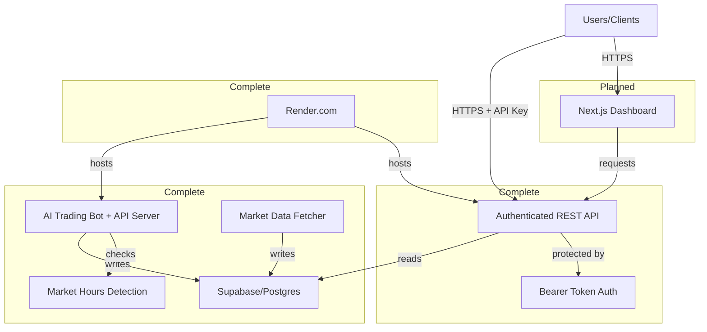

# QualQuant: AI Trading Bot & Live Dashboard
**TOTAL HARD-RESETS: 2**

## Project Overview
An end-to-end, **transparent sandbox** where an AI trading bot generates simulated trades (via Alpaca paper trading) and broadcasts its portfolio, trade log, and performance through a public web dashboard. The bot implements a simple but effective trading strategy using SMA/RSI crossovers with strict risk management. This project is designed to be educational and transparent, not advisory.

## Project Status
- ✅ Backend trading bot (Complete)
- ✅ Database setup (Complete)
- ✅ REST API with authentication (Complete)
- ✅ Market hours detection (Complete)
- 🚧 Frontend dashboard (Planned)

## Core Features
- 🤖 AI-powered trading bot using 20/50-day SMA crossover + RSI (70/30) strategy
- 🔐 Secure REST API with Bearer token authentication
- 🕐 Market hours detection (Mon-Fri 9:30AM-4:00PM ET) to avoid unnecessary API calls
- 📊 Live dashboard with portfolio tracking and equity curve (Coming Soon)
- 📈 Performance visualization vs. S&P 500 (delayed) (Coming Soon)
- 📝 Real-time trade feed with detailed order information (Coming Soon)
- ⚡ 15-minute delayed market data from Tiingo/Alpha Vantage
- 🔒 Paper trading only - no real capital at risk
- 📊 Comprehensive backtesting and performance metrics
- 🔄 Automated trading cycle every 5 minutes during market hours
- 📱 Responsive design with WCAG 2.1 AA compliance (Coming Soon)

## System Architecture



## Setup Instructions

### Prerequisites
- Python 3.9+
- Docker and Docker Compose
- Supabase account
- Alpaca paper trading account
- Tiingo API key
- Alpha Vantage API key (backup)

### Environment Variables

The project requires different environment variable configurations for backend and frontend components.

#### Backend Environment Variables
Create a `.env` file in the root directory with the following variables:

```env
# API Keys
ALPACA_API_KEY=your_alpaca_key
ALPACA_SECRET_KEY=your_alpaca_secret
TIINGO_API_KEY=your_tiingo_key
ALPHA_VANTAGE_API_KEY=your_alpha_vantage_key

# Database
SUPABASE_URL=your_supabase_url
SUPABASE_KEY=your_supabase_key

# API Security
API_KEY=your_secure_api_key_for_endpoints

# Trading Parameters
MAX_POSITIONS=3
RISK_PER_TRADE=0.02
STOP_LOSS=0.05
STARTING_EQUITY=100000
MAX_POSITION_SIZE=0.1

# Bot Configuration (for deployment)
TRADING_SYMBOL=AAPL
TRADING_INTERVAL=300
RUN_MODE=bot
```

#### Frontend Environment Variables
Create a `.env.local` file in the `frontend/` directory:

```env
# Frontend Environment Variables
# API Configuration
API_BASE_URL=http://localhost:8000
API_KEY=your_secure_api_key_for_endpoints

# For production deployment, set API_BASE_URL to your deployed API service URL
# Example: API_BASE_URL=https://your-api-service.onrender.com
```

**Important Notes:**
- The `API_KEY` must match between backend and frontend
- Frontend uses `Authorization: Bearer <API_KEY>` header format
- For local development, use `http://localhost:8000` for API_BASE_URL
- For production, update API_BASE_URL to your deployed API service URL
- Next.js requires environment variables to be in `.env.local` for local development

### Installation

1. Clone the repository:
```bash
git clone https://github.com/yourusername/qualquant.git
cd qualquant
```

2. Create and activate a virtual environment:
```bash
python -m venv venv
source venv/bin/activate  # On Windows: venv\Scripts\activate
```

3. Install dependencies:
```bash
pip install -r requirements.txt
```

4. Set up the database (apply schema.sql to your Supabase/Postgres instance):
```bash
psql $SUPABASE_URL < backend/app/db/schema.sql
```

### Running the Bot

#### Using Docker (Recommended)
```bash
docker-compose up -d
```

#### Manual Start (Main Trading Loop)
```bash
python -m backend.app.main --symbol AAPL
```

#### Automated 5-Minute Trading Cycle (Cron Job)
- The project includes a `crontab` file that runs the trading loop every 5 minutes:
  ```cron
  # Bot now runs as Render background worker, no cron needed
  # Previous: */5 * * * * cd /app && PYTHONPATH=/app python backend/app/bot_runner.py >> /app/logs/cron.log 2>&1
  ```
- You can install this cron job or use Docker Compose for scheduled runs.

### Running Tests
- All backend tests must pass before deployment or further development.
- The test suite automatically loads your `.env` file (using `python-dotenv` in `conftest.py`).
- To run all tests **with Docker Compose** (recommended for production parity):
```bash
docker-compose run --entrypoint "" trading-bot env PYTHONPATH=/app pytest backend/tests --maxfail=5 --disable-warnings -v
```
- To run all tests **locally**:
```bash
pytest backend/tests --maxfail=5 --disable-warnings -v
```
- If you encounter environment variable issues, run with explicit env vars:
```bash
SUPABASE_URL=your_supabase_url SUPABASE_KEY=your_supabase_key pytest backend/tests --maxfail=5 --disable-warnings -v
```

## Technical Stack
- Backend: Python (FastAPI, modular, see backend/app/ and bot/)
- API: FastAPI with Bearer token authentication (Complete)
- Frontend: Next.js (Planned)
- Database: Supabase/Postgres
- Data Sources: Tiingo (primary), Alpha Vantage (backup)
- Deployment: Render.com (API + Bot), Docker containers
- Security: API key authentication, rate limiting, market hours detection

## API Endpoints

The backend provides a secure RESTful API for accessing trading data. Protected endpoints require API key authentication via Bearer token. All endpoints include rate limiting (30 requests/minute) and legal disclaimers.

### Base URL
- **Production**: `https://qualquant.onrender.com`
- **Local Development**: `http://localhost:8000`

### Authentication

Protected endpoints require API key authentication using Bearer tokens:

```bash
# Include API key in Authorization header
curl -H "Authorization: Bearer YOUR_API_KEY" \
     https://qualquant.onrender.com/api/portfolio
```

**Authentication Responses:**
- `401`: Missing or invalid API key
- `429`: Rate limit exceeded

### System Health Endpoints (Public)

#### `GET /health` 🔓
Basic health check for the API server (no authentication required).

**Response:**
```json
{
  "status": "healthy",
  "timestamp": 1671234567.89
}
```

#### `GET /` 🔓
Root endpoint returning basic API information (no authentication required).

**Response:**
```json
{
  "message": "Trading Bot API",
  "version": "1.0.0", 
  "status": "running"
}
```

### Protected Endpoints (Require API Key)

#### `GET /api/status` 🔐
Detailed system status including database health and data freshness.

**Response:**
```json
{
  "status": {
    "database": "healthy",
    "api": "healthy"
  },
  "data_delay_minutes": 5,
  "last_update": "2025-06-19T02:45:00Z",
  "system_time": "2025-06-19T02:50:00Z",
  "version": "1.0.0",
  "disclaimer": "This service is for informational and educational purposes only..."
}
```

#### `GET /api/portfolio` 🔐
Current portfolio state including positions, equity, and P&L.

**Response:**
```json
{
  "positions": [
    {
      "symbol": "AAPL",
      "quantity": 10,
      "average_entry_price": 150.00,
      "current_price": 155.00,
      "unrealized_pnl": 50.00,
      "timestamp": "2025-06-19T02:45:00Z"
    }
  ],
  "current_equity": 100500.00,
  "total_pl": 50.00,
  "timestamp": "2025-06-19T02:45:00Z",
  "data_delay_minutes": 15,
  "disclaimer": "..."
}
```

#### `GET /api/trades` 🔐
Trade history with pagination support.

**Query Parameters:**
- `page` (int, default: 1): Page number for pagination
- `page_size` (int, default: 20, max: 100): Number of trades per page
- `symbol` (string, optional): Filter trades by symbol (e.g., "AAPL")

**Example:** `GET /api/trades?page=1&page_size=20&symbol=AAPL`

**Response:**
```json
{
  "trades": [
    {
      "id": 123,
      "order_id": "abc-123-def",
      "symbol": "AAPL",
      "side": "buy",
      "quantity": 10,
      "price": 150.00,
      "timestamp": "2025-06-19T02:45:00Z",
      "strategy": "SMA_RSI",
      "profit_loss": null,
      "status": "completed"
    }
  ],
  "pagination": {
    "page": 1,
    "page_size": 20,
    "total_count": 45,
    "total_pages": 3
  },
  "data_delay_minutes": 15,
  "disclaimer": "..."
}
```

#### `GET /api/performance` 🔐
Equity curve data and performance metrics.

**Query Parameters:**
- `days` (int, default: 30, range: 1-365): Number of days of historical data

**Example:** `GET /api/performance?days=30`

**Response:**
```json
{
  "equity_curve": [
    {
      "timestamp": "2025-06-19T02:45:00Z",
      "equity": 100000.00,
      "cash": 95000.00,
      "total_value": 100500.00
    }
  ],
  "metrics": {
    "initial_equity": 100000.00,
    "final_equity": 100500.00,
    "total_return_percent": 0.5,
    "period_days": 30
  },
  "data_delay_minutes": 15
}
```

#### `GET /api/signals` 🔐
Latest trading signals and technical indicators.

**Response:**
```json
{
  "signals": {
    "AAPL": {
      "signal": 1,
      "side": "buy",
      "data": {
        "SMA20": 148.50,
        "SMA50": 145.20,
        "RSI": 65.4,
        "close": 150.00
      }
    }
  },
  "timestamp": "2025-06-19T02:45:00Z",
  "data_delay_minutes": 15,
  "disclaimer": "..."
}
```

### API Features

- **Authentication**: Bearer token API key authentication for protected endpoints
- **Market Hours**: Bot only trades during market hours (Mon-Fri 9:30AM-4:00PM ET)
- **Rate Limiting**: 30 requests per minute per IP address
- **CORS**: Enabled for all origins (configure for production)
- **Error Handling**: Consistent JSON error responses
- **Data Delay**: All responses include `data_delay_minutes` field (≤15 minutes)
- **Legal Compliance**: All responses include educational disclaimer
- **Pagination**: Large datasets use cursor-based pagination
- **Filtering**: Symbol-based filtering where applicable

### Error Responses

All endpoints return consistent error responses:

```json
{
  "detail": "Error description",
  "timestamp": 1671234567.89
}
```

Common HTTP status codes:
- `200`: Success
- `400`: Bad Request (invalid parameters)
- `401`: Unauthorized (missing or invalid API key)
- `429`: Too Many Requests (rate limit exceeded)
- `500`: Internal Server Error

## Backend API & Data Model Updates
- All API endpoints now include a `data_delay_minutes` field and a legal `disclaimer` in their JSON responses.
- Backend endpoints are in `backend/app/api/endpoints/`.
- Market data fetcher is in `backend/app/services/fetcher.py`.
- Risk management logic is in `bot/risk/risk.py`.
- Main trading loop is in `backend/app/main.py` (runs as Render background worker).
- All upserts (positions, equity, signals) require unique constraints in the DB schema (see `backend/app/db/schema.sql`).
- Trade creation requires a unique, non-null `order_id`.

## Repository Architecture


## Module Documentation

### Core Modules
- `main.py` - Main trading loop and orchestration
  - Runs the 5-minute trading cycle (via cron or manual run)
  - Handles error recovery and logging
  - Integrates data fetch, signal generation, risk management, and trade execution

- `config.py` - Configuration management
  - Environment variable validation
  - Trading parameters
  - API credentials

- `utils.py` - Shared utilities
  - Logging configuration
  - Error handling
  - Helper functions

### Data Layer
- `services/fetcher.py` - Market data management
  - Rate-limited API calls
  - Data caching
  - Fallback data sources
  - Retry/backoff logic

### Strategy Layer
- `bot/strategy/signals.py` - Trading signals
  - 20/50-day SMA crossover logic
  - RSI (70/30) filter
  - Signal generation

- `bot/risk/risk.py` - Risk management
  - 2% account equity per trade
  - 5% stop-loss implementation
  - Maximum 3 open positions

- `bot/backtest/backtest.py` - Strategy validation
  - Historical performance analysis
  - Sharpe ratio calculation
  - Strategy optimization

### Broker Layer
- `services/broker/paper.py` - Alpaca integration
  - Paper trading execution
  - Position management
  - Order validation

### Database Layer
- `db/supabase.py` - Data persistence
  - Trade history
  - Portfolio state
  - Performance metrics

## Testing
- Unit, integration, and end-to-end tests for all backend modules
- `.env` is loaded automatically for tests (see `conftest.py`)
- All tests must pass before deployment or further development
- Run tests with:
```bash
pytest backend/tests --maxfail=5 --disable-warnings -v
```

## Database Schema Notes
- All upserts require unique constraints (see `backend/app/db/schema.sql`)
- `trades.order_id` must be unique and non-null
- `positions.symbol` is unique
- `equity.timestamp` is unique
- `signals.(symbol, timestamp, strategy)` is a composite unique constraint

## Disclaimer
Simulated paper-trading results. Prices delayed ≥ 15 minutes. Educational content only — *not* investment advice. This project is for educational purposes only and should not be used for real trading without proper risk assessment and professional guidance.
